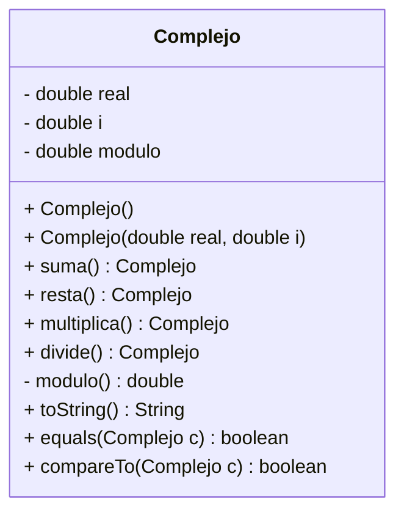

```mermaid
classDiagram
class Complejo {
  - double real
  - double i
  - double modulo

  + Complejo()
  + Complejo(double real, double i)
  + suma() Complejo
  + resta() Complejo
  + multiplica() Complejo
  + divide() Complejo
  - modulo() double
  + toString() String
  + equals(Complejo c) boolean
  + compareTo(Complejo c) boolean
}
```
